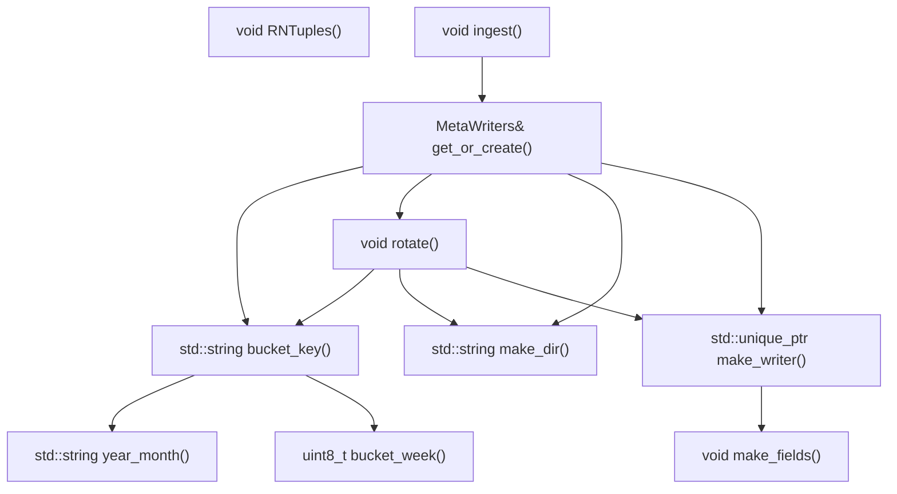
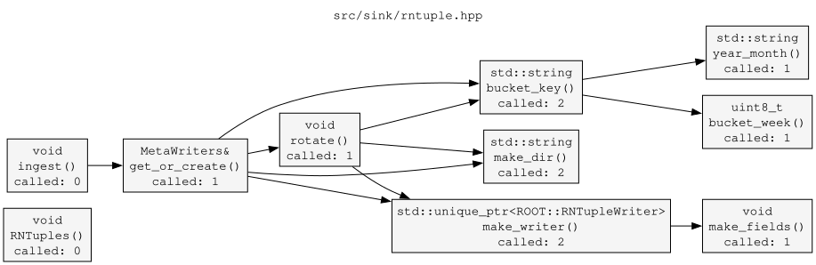
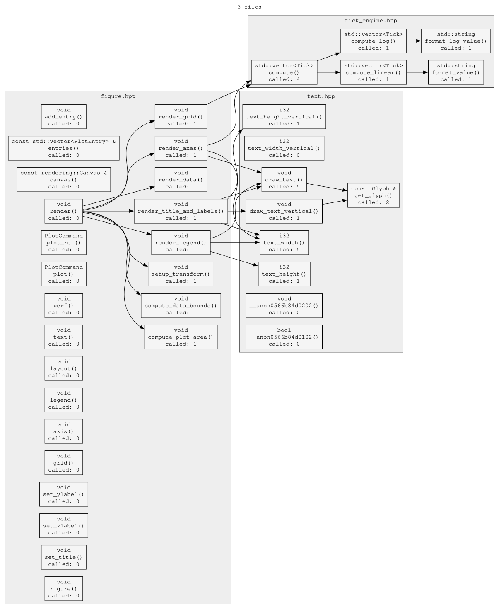

# calltree.sh 🌳

ASCII call tree generator for C, C++, Python, Rust, Go, Java, JavaScript, TypeScript, Ruby, Lua, PHP, Perl, C#, Kotlin, Scala, Swift and ~25 other languages - single file or whole project.
Parses defs via [universal-ctags](https://github.com/universal-ctags/ctags), resolves call edges with a small Perl backend, renders as a tree. Supports cross-file resolution, recursive dir scan, include/exclude filters, exports to Mermaid/DOT/text.

```
  src/sink/rntuple.hpp  (depth=4)

RNTuples()  -> void

ingest()  -> void
└── get_or_create()  -> MetaWriters&
    ├── bucket_key()  -> std::string
    │   ├── year_month()  -> std::string
    │   └── bucket_week()  -> uint8_t
    ├── rotate()  -> void
    │   ├── bucket_key()  -> std::string  [seen]
    │   ├── make_dir()  -> std::string
    │   └── make_writer()  -> std::unique_ptr<ROOT::RNTupleWriter>
    │       └── make_fields()  -> void
    ├── make_dir()  -> std::string
    └── make_writer()  -> std::unique_ptr<ROOT::RNTupleWriter>  [seen]
```

---

## Dependencies

| Dep | Notes |
|-----|-------|
| `bash` | >= 4.0 |
| `perl` | standard on Linux/macOS; needs only `JSON::PP`, core since 5.14 |
| `universal-ctags` | with `+json`; not exuberant-ctags |
| `graphviz` | optional, only to render `.dot` (`dot -Tsvg`) |

Install universal-ctags:

```bash
sudo apt install universal-ctags   # Debian/Ubuntu
sudo dnf install ctags             # Fedora
sudo pacman -S ctags               # Arch
brew install universal-ctags       # macOS
pkg install universal-ctags        # FreeBSD
```

Verify:

```bash
ctags --version | head -1          # must say "Universal Ctags"
ctags --list-features | grep json  # must list "json"
```

---

## Installation

```bash
git clone https://github.com/MoonFlowww/CallTree
cd CallTree
chmod +x calltree.sh
```

Or drop it on `$PATH`: `cp calltree.sh ~/.local/bin/calltree`

---

## Usage

```
calltree.sh FUNC PATH [PATH ...] [OPTIONS]
```

`FUNC` is required, always the first argument: a bare function name, or a `filepath::::funcname` key to pin a specific file. Output is scoped to FUNC's reachable subgraph (root highlighted in Mermaid/DOT). Pass `""` for FUNC to skip scoping and map every root in the analyzed set instead - this is the only way back to the old whole-codebase dump.

`PATH` is a file or dir, repeatable, freely mixed, and always comes after FUNC. Dirs are scanned recursively for known extensions.

```bash
./calltree.sh main src/main.cpp                        # single file, rooted at main
./calltree.sh "" src/main.cpp src/util.cpp lib/io.hpp   # multiple files, no scoping
./calltree.sh "" src/                                   # whole dir, every root
./calltree.sh "" src/ include/ vendor/one_file.cpp      # mixed files+dirs
./calltree.sh "" src/ -I "*.cpp" -E "test_*"            # filtered dir
./calltree.sh myfunc -- -weird-file.cpp                 # path starting with dash
```

### Options

| Flag | Arg | Default | What |
|------|-----|---------|------|
| `-I` | `PATTERN` | - | include glob, basename match, repeatable, applied before `-E` |
| `-E` | `PATTERN` | - | exclude glob, basename match, repeatable, wins over `-I` |
| `-d` | `N` | `4` | max tree depth |
| `-out-T` | `[FILE]` | `<base>.txt` | write plain text (no ANSI) |
| `-out-M` | `[FILE]` | `<base>.mmd` | write Mermaid; multi-file wraps each file in a subgraph |
| `-out-D` | `[FILE]` | `<base>.dot` | write Graphviz DOT; multi-file wraps each file in a cluster |
| `-bg-d` | - | - | dark background for Mermaid/DOT |
| `-bg-w` | - | - | white background for Mermaid/DOT |
| `-c` | - | off | colorize function names (256-color ANSI) |
| `-s` | - | off | always expand repeated subtrees (disable `[seen]`) |
| `-t` | - | off | no terminal output, only `-out-*` files |
| `-p` | - | off | performance footer: timings + line counters |
| `-v` | - | - | print version, exit |
| `-w` | - | - | print script's absolute path, exit |
| `-h` | - | - | print help + full language list, exit |
| `--` | - | - | end of options, rest are paths |

`-out-*` FILE arg is optional; if given it must end with the matching extension (`.txt`/`.mmd`/`.dot`), else it's read as the next path and the output name is auto-derived:

```bash
./calltree.sh foo src/foo.cpp -out-M            # -> src/foo.mmd
./calltree.sh foo src/foo.cpp -out-M graph.mmd  # -> graph.mmd (explicit)
./calltree.sh "" src/ -out-M                    # -> src/calltree.mmd
./calltree.sh "" a.cpp b.cpp -out-D             # -> ./calltree.dot
```

### Supported languages

Anything universal-ctags can parse is a candidate; explicit kind allow-list below, permissive fallback otherwise. Full list also in `calltree.sh -h`.

| Language | Extensions | Return types |
|---|---|---|
| C / C++ | `.c .h .cpp .hpp .cc .cxx .hxx` | yes |
| C# | `.cs` | yes |
| Python | `.py` | `-` (no annotations) |
| Go | `.go` | yes |
| Rust | `.rs` | yes (from `-> T` in sig) |
| Java | `.java` | yes |
| JavaScript / TypeScript | `.js .jsx .ts .tsx` | partial (TS yes) |
| Ruby | `.rb` | `-` |
| Lua | `.lua` | `-` |
| PHP | `.php` | yes |
| Perl | `.pl .pm` | `-` |
| Kotlin | `.kt` | yes |
| Scala | `.scala` | yes |
| Swift | `.swift` | yes |
| Haskell, OCaml, F# | `.hs .ml .fs` | best effort |

Untyped languages (Python, Ruby, Lua, Perl) show `-` in the return type column.

---

## Examples

```bash
./calltree.sh "" src/sink/rntuple.hpp -d 2       # limit depth, no scoping
./calltree.sh rotate src/sink/rntuple.hpp        # start from one function
./calltree.sh rotate src/sink/rntuple.hpp -c     # colorize (stable per-name 256-color, clamped 40-210, also colors the "calls" column)
./calltree.sh rotate src/sink/rntuple.hpp -t -out-T -out-M -out-D   # silent, files only
./calltree.sh rotate src/sink/rntuple.hpp -p     # perf footer
./calltree.sh rotate src/sink/rntuple.hpp -c -s -p -out-T -out-M -out-D   # everything at once
```

`calltree.sh rotate ...` output:

```
rotate()  -> void
├── bucket_key()  -> std::string
│   ├── year_month()  -> std::string
│   └── bucket_week()  -> uint8_t
├── make_dir()  -> std::string
└── make_writer()  -> std::unique_ptr<ROOT::RNTupleWriter>
    └── make_fields()  -> void
```

Perf footer (`file` row/counter only appears when an `-out-*` flag is used; `-t` shows `0 lines (cli, suppressed by -t)`):

```
  mapping        207 ms
  print           43 ms
  file           112 ms
  ──────────────────────
  total          362 ms

  read           127 lines (src)
  write           70 lines (cli)
                 206 lines (file)
```

| Row | Meaning |
|---|---|
| `mapping` | ctags parse + perl call-edge analysis + bash array load |
| `print` | tree/table render for terminal |
| `file` | all `-out-*` writes combined |
| `total` | wall time |
| `read` | source lines consumed |
| `write / cli` | lines written to terminal |
| `write / file` | lines written across `-out-*` files |

### Mermaid export

`-out-M` writes `.mmd` fenced in ` ```mermaid ``` `, renders directly on GitHub/GitLab/Notion.



### Graphviz DOT export

```bash
./calltree.sh "" src/sink/rntuple.hpp -out-D
dot -Tsvg -o graph.svg src/sink/rntuple.dot
dot -Tpng -o graph.png src/sink/rntuple.dot
```

Labels include return type + call frequency. Layout: orthogonal edges (`splines=ortho`), merged segments (`concentrate=true`), rounded nodes, extra rank/node spacing.

FUNC exports just one function's subgraph, root highlighted:

```bash
./calltree.sh createButton src/ -out-D
```



### Plain text export

`-out-T` - same layout as terminal, no ANSI, safe to grep/diff/commit.

---

## Multi-file mode

Activated by more than one input file (multiple paths or dir scan). All flags work the same; adds `[basename]` tags in the tree and a `file` column in the table.

```bash
./calltree.sh "" src/core.cpp src/net.cpp -d 3   # two explicit files
./calltree.sh "" src/ -d 4                       # recursive dir scan
./calltree.sh "" src/ include/ tests/ -d 3       # multiple dirs, merged into one analysis
```

```
  2 files  (depth=3)

dispatch()  [core.cpp]  -> void
├── make_key()  [core.cpp]  -> std::string
│   └── format()  [net.cpp]  -> int
└── send()  [net.cpp]  -> void
    ├── encode()  [net.cpp]  -> std::string
    │   └── compress()  [net.cpp]  -> std::string
    └── flush()  [net.cpp]  -> void
        └── write_buf()  [net.cpp]  -> void
```

Filtering (`-I`/`-E` match basename via shell glob, both repeatable, `-I` applied first):

```bash
./calltree.sh "" src/ -I "*.cpp"                          # implementation only
./calltree.sh "" src/ -E "*.pb.cc" -E "test_*" -E "*_mock.*"  # exclude generated/test
./calltree.sh "" src/ -I "*.cpp" -E "test_*"              # combined
./calltree.sh "" src/ -I "*.rs" -I "*.go"                 # only Rust and Go
```

Rooting across files:

```bash
./calltree.sh dispatch src/                          # bare name, auto-picks first file defining it
./calltree.sh "src/core.cpp::::dispatch" src/        # fully-qualified key, pin a file
```

`FILE::::FUNC` uses four colons as separator - safe since `::::` doesn't appear in normal identifiers/paths.

Multi-file Mermaid: each file's functions grouped in a named `subgraph`, cross-file edges connect across them, node IDs are `SAFE_BASENAME_funcname` to stay unique.

Multi-file DOT: each file becomes `subgraph cluster_N` with its own label/background; cross-cluster edges use full-path node IDs.

```bash
./calltree.sh "" src/ -out-D && dot -Tsvg -o graph.svg src/calltree.dot
```



---

## Summary table

Always printed below the tree; multi-file adds a `file` column.

```
  function                      called  calls                                     return type
  ────────────────────────────  ──────  ────────────────────────────────────────  ──────────────────────
  bucket_week                        1  ----                                      uint8_t
  year_month                         1  ----                                      std::string
  bucket_key                         2  year_month bucket_week                    std::string
  make_dir                           2  ----                                      std::string
  rotate                             1  bucket_key make_dir make_writer           void
  make_fields                        1  ----                                      void
  make_writer                        2  make_fields                               std::unique_ptr<ROOT::RNTupleWriter>
```

| Column | Meaning |
|--------|-------------|
| `function` | name as defined |
| `file` | basename of defining file (multi-file only) |
| `called` | total invocation count across all callers in the set |
| `calls` | space-separated callees (display names, no path) |
| `return type` | from ctags `typeref` or signature parse; `-` if untyped |

---

## How it works

```
  universal-ctags  --(json tags)-->  perl backend  --(CALLS/TYPES/FREQ)-->  bash renderer
```

1. **ctags** parses every input file, emits one JSON line per tag with `name`, `path`, `language`, `line`, `end`, `kind`, `typeref`, `signature`.
2. **perl** filters by per-language kind allow-list, drops anon ctags names (lambdas, anon struct/union), builds a global `funcname -> [files]` registry, re-reads each source file, extracts each function's `line..end` body, scans it for callees matching known names (method calls excluded via `(?<![>.])` lookbehind).
3. **bash** loads `CALLS`/`TYPES`/`FREQ` into assoc arrays, renders tree/table/exports.

### Single-file vs multi-file

Single-file: keys are bare names. Multi-file: internal key is `filepath::::funcname` everywhere (tree, table, exports) - four colons chosen because it can't appear in typical identifiers. Display always strips back to bare name; file shown as a separate annotation/column.

### What counts as a function

Per-language ctags kind allow-list:

| Language | Accepted kinds |
|---|---|
| C | `function` |
| C++ | `function`, `class`, `struct` (types are construction targets, see below) |
| C# | `method` |
| Python | `function`, `member` (class methods) |
| Go | `func` |
| Rust | `function`, `method` |
| Java, Kotlin | `method` |
| JavaScript, TypeScript | `function`, `method`, `getter`, `setter`, `generator` |
| Ruby | `method`, `singletonMethod` |
| Lua, PHP | `function` |
| Perl | `subroutine` |
| Scala, Swift | `method`, `function` |

Other languages fall back to `function`, `method`, `func`, `fn`, `subroutine`. Anon ctags names (e.g. `__anon0566b84d0102`) are filtered out.

### Return type extraction

Tried in order: (1) ctags `typeref` field, `typename:` prefix stripped - populated for C, C++, Go, Java, TypeScript, Kotlin, PHP, others; (2) signature parse - Rust etc embed `(args) -> Type`, tail extracted when typeref missing; (3) fallback - `void` for C/C++, `-` for untyped langs (Python, Ruby, Lua, Perl, untyped JS).

### Call edge detection

Reads each function's `line..end`, strips comments/string literals (best-effort, not language-perfect), scans with several patterns. A match only counts if the identifier is in the global known-definitions registry (`all_known`) - this is what keeps every extra pattern below from producing false edges. `.foo()`/`->foo()` method calls excluded via lookbehind, works uniformly across C/C++/Rust/Go/Java/Python/JS.

| Pattern | Catches | Enabled for |
|---|---|---|
| `name(` | plain calls; also C++ construction `Foo()`/`new Foo()` since types are known nodes | all languages |
| `name<...>(` | template calls, e.g. `makeWidget<Button>()`; requires single non-nested `<>` so `a < b > (c)` and nested generics don't misfire | angle-bracket generic langs (C++, C#, Java, TypeScript, Rust, Kotlin, Scala, Swift) |
| `&name` | function-pointer refs - factory registration/callbacks, e.g. `reg[0] = &paintButton;` | C, C++ |
| `make_unique<Type>` / `make_shared<Type>` | smart-pointer construction -> edge to the type | C++ |

**Factory -> product edges.** C++ `class`/`struct` defs are registered as known nodes, so constructing one (`new Widget()`, `Widget()`, `make_unique<Widget>()`) gets an edge to that type. Types are leaf nodes, bodies not scanned (a class span would otherwise absorb its members' calls). Since FUNC always scopes the graph, this shows exactly the factory-to-product structure for the function asked about.

### Cross-file call resolution

Pass 1 builds a global `funcname -> [files defining it]` registry. Pass 2, per callee found in that registry: same-file definition wins if present, else the first file in input order that defines it. Matches compiler lookup for non-overloaded free functions; same-file helpers are never misattributed to a homonymous function elsewhere.

### Directory scanning

`find -print0` piped through `sort -z` (handles spaces/special chars in filenames). Recognized extensions:

```
.c  .h   .cpp .hpp .cc  .cxx .hxx
.cs .py  .rs  .go  .java
.js .jsx .ts  .tsx
.rb .lua .php .pl  .pm
.scala .kt .swift .hs .ml .fs
```

`-I`/`-E` applied in bash via `case`/glob against basenames only.

### Cycle detection

Tree emitter threads a colon-delimited visited-path string down the call stack. A node re-appearing in its own ancestor path prints `[cycle]` and stops recursing. Nodes reached via different paths are drawn in full (both call sites are real).

---

## Limitations

- Name-in-body regex scan, not semantic analysis - overloaded names in different files collapse to the first definition.
- **Method/virtual dispatch** (`obj.foo()`, `ptr->foo()`, `self.foo()`) intentionally excluded - needs static-type inference; a name-only match would misattribute every `->foo()` to the first same-named def. OO-heavy code sees incomplete graphs. (Template calls, function-pointer refs `&name`, and constructor/factory construction ARE detected - see Call edge detection above.)
- Template/generic specializations (`process<T>` vs `process<U>`) map to the same base name. Type args only count as construction for `new`/`make_unique`/`make_shared`; a generic container like `std::vector<Widget>` is NOT read as constructing a `Widget`. Nested template args (`foo<bar<int>>()`) don't match.
- Macro-defined pseudo-functions not detected (ctags doesn't preprocess).
- Cross-file resolution picks the first matching definition when a name is defined in multiple files - no namespace/overload awareness.
- File extension must match content - renaming `foo.cpp` to `foo.py` makes ctags parse it as Python, yielding zero tags.
- File paths containing the literal `::::` aren't supported (reserved as internal key separator).
- Python lambdas, nested inner functions, and heavily decorated defs may classify oddly. Top-level `def` and class methods always work.
